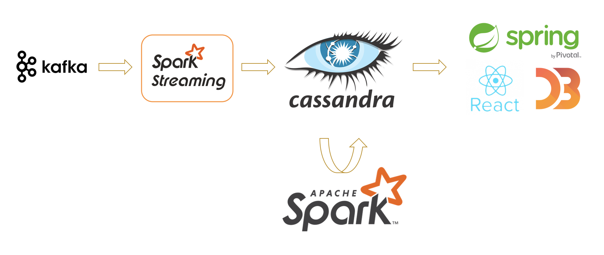

# Meetup Streaming Analysis

[demo](http://ec2-54-212-227-133.us-west-2.compute.amazonaws.com:8077/)

## Project Idea

Matching people with similar interest.

## Use cases

Meetup events that intrigues me are about Java, Spark and Cooking. Not only do I interested in learning about the topics, but also meeting with people sharing same interest. In this project, I am creating people recommendation system.

## Architecture

## Technologies

* Kafka
* Spark Streaming
* Spark
* Cassandra
* Spring/React/D3

## Dataset/Data source

* [Meetup API](https://www.meetup.com/meetup_api/) has
* Common Crawler
