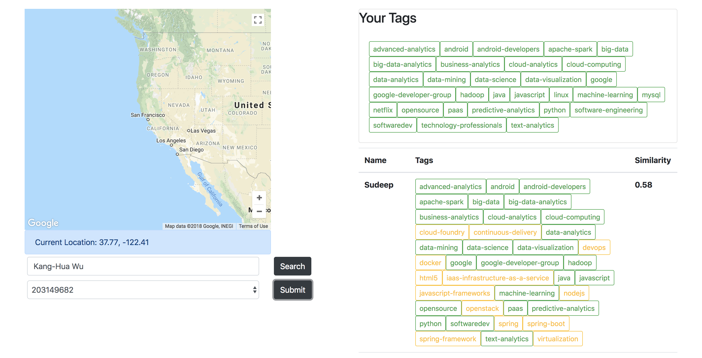
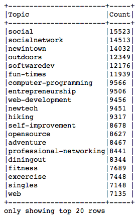
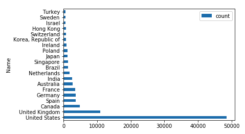
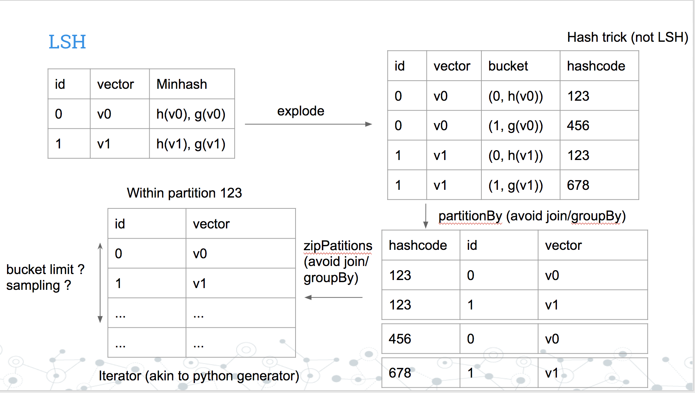
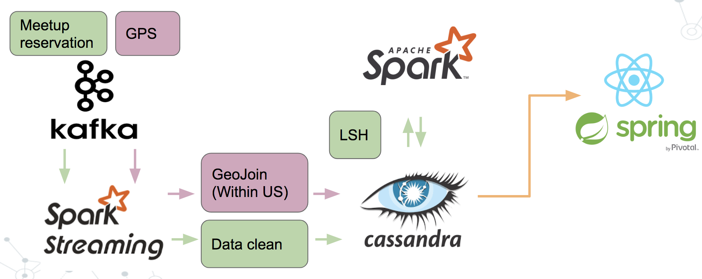

# Meetup Streaming Analysis

* [youtube](https://www.youtube.com/watch?v=E1BRSvokl5k)
* [slide](https://docs.google.com/presentation/d/11Kf2xpLBJsEpkKkzYEjY-h8L8dkQSIt_ZqJg6bE-yAQ/edit?usp=sharing)

## Project Idea

Why do people attend meetups? People are definitely interested in learning about the talks but another big deal is that people would like to connect with other people going to the same meetup because they share common interest. We can learn a lot through discussing with others. So is there a way to expand this networking opportunity even across the world. For example, if I am traveling to Europe, can I find some people that are similar to me there. This is what my project is about.

## Data Exploration

Before I start building my pipline, I performed data exploration using a subset of data could run on my desktop. Although the size of data is not extremely large, it helped me understand what sort of data I am dealing with and what APIs does Spark have. Results are presented through jupyter notebook (under [notebook](notebook) folder). There are two key take aways from this part: 1. Two most popular topics of meetup events are related to traveling and technology 2. 70% of reservations happened in USA.

## Implementation & Challenge

How do we match similar people across the world? First, let’s have a look at what does the data look like. The data is a big matrix where each row represent each user and column represent the their attribute. There are approximately 10M users and 100k interest. A brute force solution is using cartesian product where you compare one person to another one by one.

Unfortunately, cartesian product does not scale. If you have one million users, there will be one trillion comparisons. Whenever you summit a job with cartesian product, you basically stare out of the window like the fat cat waiting for you job to be finished. So I use is locality sensitive hashing (LSh) to solve this problem. Locality sensitive hashing process each row and put each person into a buckets. Then search nearest neighbors from each bucket.

The challenge with locality sensitive hashing is that if you have a skewed dataset, you would get skewed buckets. From section above, you can see that the most popular meetup events are related to travel and technology but not something like latin study. Using LSH from existing MLLib would fail with memory error even processing on a "small" dataset (~1Mx10k), so I implemented LSH with customized join (avoid using `join`/`groupBy`). High level of implementation is shown below:

## Architecture

## Technologies

* Kafka
* Spark Streaming
* Spark
* Cassandra
* Spring/React

## Dataset/Data source

* [Meetup API](https://www.meetup.com/meetup_api/)
